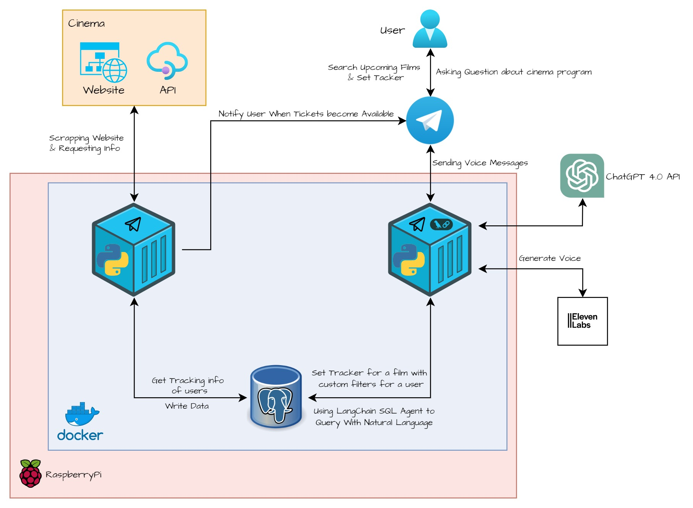

[](https://github.com/astral-sh/ruff)
[](https://github.com/dsaad68/kino-checker/actions/workflows/main.yml)

# Kino Tracker Bot (with GenAI Features)

Kino Tracker Bot is a Telegram bot that tracks the availability of movies in selected cinemas and notifies users when a movie becomes available. It answers questions about upcoming and showing films in natural language and generates voice messages through the Eleven Labs Voice API.

<p align="center">
  
</p>

Features:
- Tracks the availability of movies in selected cinemas.
- Notifies users when a movie becomes available.
- GenAI feature for asking about upcoming and showing films in natural language (Langchain SQL agent).
- Voice-generated answers through Eleven Labs Voice API.

## Quick Start

### Development

```bash
# Install dependencies
uv sync

# Start services (bot, miner, cleaner, db) with dev overrides
just dev
# or: docker compose -f docker-compose.yml -f docker-compose.dev.yml up --build
```

### Production

```bash
cp .env.example .env
# Edit .env with your credentials

just prod
# or: docker compose -f docker-compose.yml -f docker-compose.prod.yml up -d --build
```

### Tests

```bash
just test
# or: uv run pytest
```

## Architecture

See [docs/architecture.md](docs/architecture.md) for system overview, services, and data flow.

## Documentation

- [Development Guide](docs/development.md)
- [Deployment Guide](docs/deployment.md)
- [API / Integration](docs/api.md)
- [Services](docs/services/) — Bot, Miner, Cleaner

## How to Run the Bot

1. Set environment variables in `.env` (see `.env.example`).
2. Start the stack: `just dev` or `docker compose up`.

## Pre-commit

To install pre-commit hooks:

```sh
pre-commit install
```
